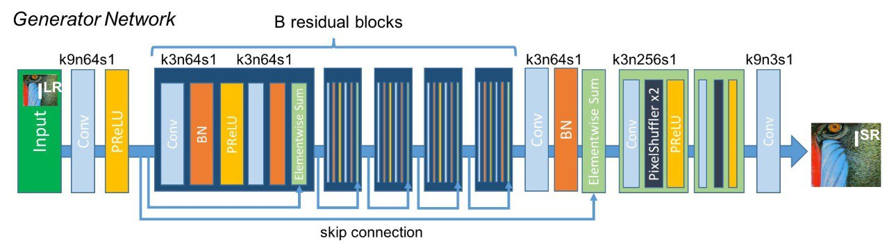
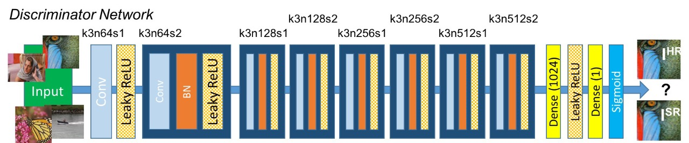
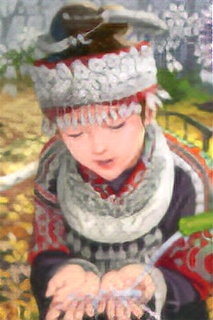

# SRGAN

> Photo-Realistic Single Image Super-Resolution Using a Generative Adversarial Network [paper](https://arxiv.org/abs/1609.04802)

## Table of contents
- [SRGAN](#srgan)
  - [Table of contents](#table-of-contents)
  - [Overview](#overview)
  - [Architecture](#architecture)
  - [Dataset](#dataset)
  - [Training](#training)
  - [Results](#results)
  - [Usage](#usage)
    - [Training](#training-1)
    - [Inference](#inference)
  - [TODO](#todo)
  - [References](#references)


## Overview
The Super-Resolution Generative Adversarial Network (SRGAN) is a deep learning model that can generate high-resolution images from low-resolution inputs. The model is trained using a combination of adversarial and content loss functions, which help to produce photo-realistic images with enhanced details.

## Architecture
The SRGAN architecture consists of two main components: a generator and a discriminator.
<br>
The **generator** is responsible for producing high-resolution images from low-resolution inputs,



 while the **discriminator** is trained to distinguish between real and generated images. The generator is trained using a combination of adversarial and content loss functions, which help to produce high-quality images with enhanced details.



## Dataset
The model is trained on the [DIV2K](https://data.vision.ee.ethz.ch/cvl/DIV2K/) dataset, which contains 800 high-resolution images of various scenes and objects. The dataset is divided into training and validation sets, which are used to train and evaluate the model's performance.

> you can also take a look at [flickr2k](https://www.kaggle.com/datasets/daehoyang/flickr2k) dataset which contains 2650 images with 2k resolution.

## Training
The model is trained for **200 epochs** using the Adam optimizer with a learning rate of 1e-4 and a batch size of 16. The training process consists of two main stages: pre-training and fine-tuning. During the pre-training stage, the generator is trained using the content loss function, while the discriminator is frozen. In the fine-tuning stage, the generator and discriminator are trained simultaneously using a combination of adversarial and content loss functions. 
> you can see all the training details in the [config](config/base.yaml) file.

> Download the pre-trained model from [here](SRGAN.pth)

## Results
The model achieves good performance on the DIV2K dataset, producing high-quality images with enhanced details and sharpness. **because of the limited resources, I trained the model for only 200 epochs, so the results are not as good as the original paper.**

> all the training and results done using **Nvidia GTX 1660ti GPU**.
<table>
  <tr>
    <td>
    Input:
    
    </td>
    <td>
    Output:
    
    </td>
  </tr>
</table>

## Usage
install the required packages using the following command.
```bash
pip install -r requirements.txt
```

### Training
To train the model, I recommend read the [trainingDetails](trainingDetails.md) file to understand all the training details and hyperparameters.


### Inference
To test the model, you can use the [inference](inference.py) script, which loads the pre-trained model and generates high-resolution images from low-resolution inputs.
all the images in the inputs folder passed through the model and the generated images will be saved in the outputs folder by default.
    
```bash
python inference.py --model_path model.pth --image_path inputs/
--save_path outputs/ --device cuda
```
> `--model_path` is the path to the pre-trained model.

> `--image_path` is the path to the input images.

> `--save_path` is the path to save the generated images.

> `--device` can be either 'cuda' or 'cpu' depending on the available resources.

## TODO
- [ ] Train the model for more epochs to achieve better results.
- [ ] Implement [ESRGAN](https://arxiv.org/abs/1809.00219) model and compare the results with SRGAN.

## References
- [Photo-Realistic Single Image Super-Resolution Using a Generative Adversarial Network](https://arxiv.org/abs/1609.04802)
- [DIV2K dataset](https://data.vision.ee.ethz.ch/cvl/DIV2K/)